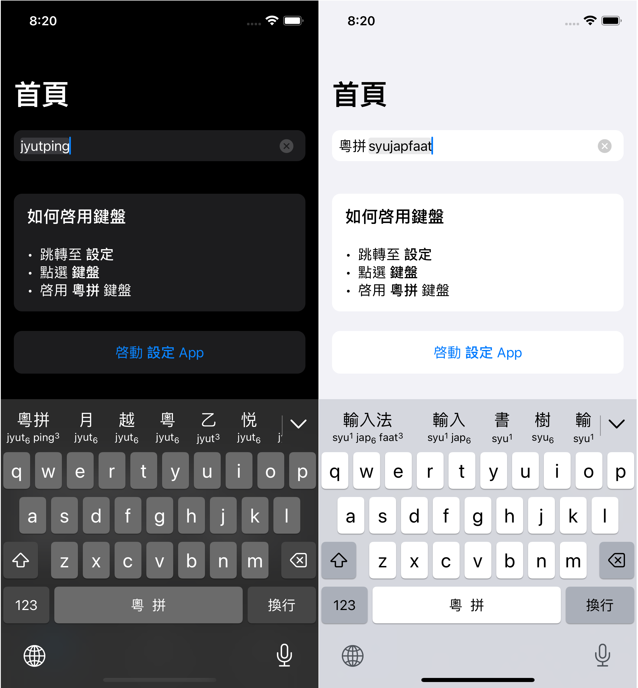

Learn iOS Keyboard with Jyutping
======

想要使用 SwiftUI 制作一款 iOS 的输入法键盘. 我的知识储备主要是 c/c++, 对于 Swift 只有稍微看过一点入门教程. 偶然发现了这款开源输入法, 决定从阅读其代码开始学习.

以下是原 README

Jyutping Keyboard for iOS.

## Now available on the App Store

  

 

## Screenshots

  

## Running compatibility
iOS 13.0+

## Build requirements
Xcode 12.0+

## Credits
- [SwiftyOpenCC](https://github.com/ddddxxx/SwiftyOpenCC)  
- [rime-cantonese](https://github.com/rime/rime-cantonese)
